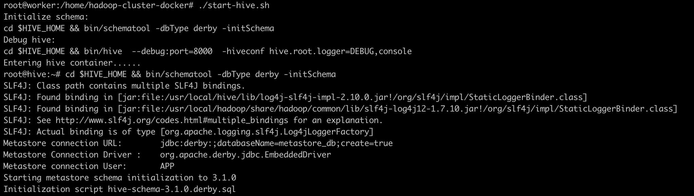
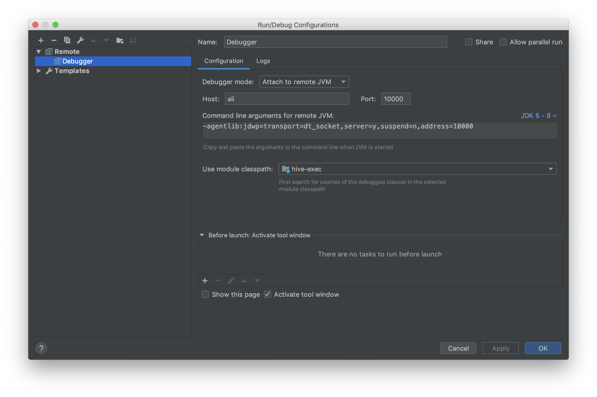
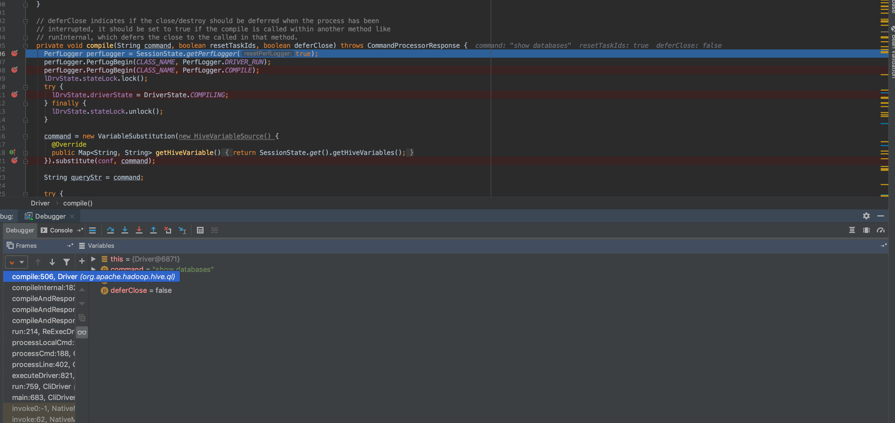

## 利用Docker启动Hadoop集群与Hive并调试

对Hadoop、Hive、Spark等大数据组件进行开发调试时，往往需要我们将最新编译好jar包，上传到测试机器或生产机器上进一步调试开发。这种方案在有些情况下，不是很方便直观，比如：Hive语法解析这类并不需要跑实际任务的开发工作。为了提高开发效率，我们可以通过Docker在本地启动一个分布式的Hadoop集群，来调试HDFS、Yarn、Hive、Spark等组件。本地调试OK了，便可上测试环境或生产环境进一步调试优化。


本文主要有三个部分：
- 编译Hadoop和Hive镜像
- 利用Docker启动一个3节点的Hadoop集群
- 利用启动Hive并调试


### 一、编译镜像

1. 编译基础镜像: 安装jdk、openssh-server。 编译命令：` cd 工作目录 && docker build -f Dockerfile.base -t tkanng/base .`
```Docker
# Dockerfile.base

FROM ubuntu:16.04
RUN  apt-get update && apt-get install -y openssh-server wget

RUN mkdir -p /usr/lib/jvm/


# Please download jdk before building base image....
COPY jdk1.8.0_211 /usr/lib/jvm/jdk1.8.0_211

ENV JAVA_HOME=/usr/lib/jvm/jdk1.8.0_211

ENV PATH=$PATH:$JAVA_HOME/bin
```

2. 编译Hadoop镜像：在基础镜像的基础上，安装Hadoop、配置ssh免密、配置Hadoop、格式化NameNode。
```Docker
# Dockerfile

FROM tkanng/hadoop:base

WORKDIR /root


ARG HADOOP_VERSION=2.7.7

# 如果清华的镜像源不存在对应版本的hadoop，请更换为Apache的地址
RUN wget https://mirrors.tuna.tsinghua.edu.cn/apache/hadoop/common/hadoop-${HADOOP_VERSION}/hadoop-${HADOOP_VERSION}.tar.gz && \
    tar -xzvf hadoop-${HADOOP_VERSION}.tar.gz && \
    mv hadoop-${HADOOP_VERSION} /usr/local/hadoop && \
    rm hadoop-${HADOOP_VERSION}.tar.gz

# set environment variable
ENV HADOOP_HOME=/usr/local/hadoop 
ENV PATH=$PATH:/usr/local/hadoop/bin:/usr/local/hadoop/sbin 
ENV HADOOP_VERSION=${HADOOP_VERSION}
# ssh 免密
RUN ssh-keygen -t rsa -f ~/.ssh/id_rsa -P '' && \
    cat ~/.ssh/id_rsa.pub >> ~/.ssh/authorized_keys


# hdfs目录，在hdfs-site.yaml中配置
RUN mkdir -p ~/hdfs/namenode && \ 
    mkdir -p ~/hdfs/datanode && \
    mkdir $HADOOP_HOME/logs

COPY config/* /tmp/

RUN mv /tmp/ssh_config ~/.ssh/config && \
    mv /tmp/hadoop-env.sh /usr/local/hadoop/etc/hadoop/hadoop-env.sh && \
    mv /tmp/hdfs-site.xml $HADOOP_HOME/etc/hadoop/hdfs-site.xml && \ 
    mv /tmp/core-site.xml $HADOOP_HOME/etc/hadoop/core-site.xml && \
    mv /tmp/mapred-site.xml $HADOOP_HOME/etc/hadoop/mapred-site.xml && \
    mv /tmp/yarn-site.xml $HADOOP_HOME/etc/hadoop/yarn-site.xml && \
    mv /tmp/slaves $HADOOP_HOME/etc/hadoop/slaves && \
    mv /tmp/start-hadoop.sh ~/start-hadoop.sh && \
    mv /tmp/run-wordcount.sh ~/run-wordcount.sh

RUN chmod +x ~/start-hadoop.sh && \
    chmod +x ~/run-wordcount.sh && \
    chmod +x $HADOOP_HOME/sbin/start-dfs.sh && \
    chmod +x $HADOOP_HOME/sbin/start-yarn.sh 

# 格式化NameNode
RUN /usr/local/hadoop/bin/hdfs namenode -format
# 启动ssh server
CMD [ "sh", "-c", "service ssh start; bash"]

```

3. 编译Hive镜像
```Docker
#Dockerfile.hive

FROM tkanng/hadoop:2.7.7

ARG HIVE_VERSION=2.3.5

# 如果清华的镜像源不存在对应版本的hadoop，请更换为Apache的地址
# wget https://archive.apache.org/dist/hive/hive-${HIVE_VERSION}/apache-hive-${HIVE_VERSION}-bin.tar.gz 
RUN wget https://mirrors.tuna.tsinghua.edu.cn/apache/hive/hive-${HIVE_VERSION}/apache-hive-${HIVE_VERSION}-bin.tar.gz && \
    tar -zxvf apache-hive-${HIVE_VERSION}-bin.tar.gz && \
    mv apache-hive-${HIVE_VERSION}-bin /usr/local/hive && \
    rm apache-hive-${HIVE_VERSION}-bin.tar.gz 

ENV HIVE_HOME /usr/local/hive
ENV PATH $PATH:$HIVE_HOME/bin
```


### 二、 启动Hadoop集群

1. 创建一个bridge类型的网络，便于Hadoop容器间访问。自定义Bridge类型网络，实现了容器间的自动DNS解析，可以通过容器名称相互通信，并且容器之间所有端口相互暴露。
```
docker network create hadoop
```
2. 运行Hadoop容器节点
```sh
# start hadoop master container
sudo docker rm -f hadoop-master &> /dev/null
echo "start hadoop-master container..."
sudo docker run -itd \
                --net=hadoop \
                -p 50070:50070 \
                -p 8088:8088 \
                --name hadoop-master \
                --hostname hadoop-master \
                $Image &> /dev/null


# start hadoop slave container
i=1
while [ $i -lt $N ]
do
	sudo docker rm -f hadoop-slave$i &> /dev/null
	echo "start hadoop-slave$i container..."
	sudo docker run -itd \
	                --net=hadoop \
	                --name hadoop-slave$i \
	                --hostname hadoop-slave$i \
	                $Image &> /dev/null
	i=$(( $i + 1 ))
done 

# get into hadoop master container
sudo docker exec -it hadoop-master bash start-hadoop.sh 
```
其中`start-hadoop.sh`为：
```sh
$HADOOP_HOME/sbin/start-dfs.sh

$HADOOP_HOME/sbin/start-yarn.sh
```

如下图：


### 三、启动并调试Hive
1. 启动Hive：
```sh
# 将8000端口映射到10000端口，IDEA连接宿主机IP:10000端口即可
sudo docker run -itd -p 10000:8000 \
                --net=hadoop \
                --name hive \
                --hostname hive \
                $Image &> /dev/null
```

2. 初始化Hive并打开调试模式
```sh
docker exec -it hive bash

cd $HIVE_HOME && bin/schematool -dbType derby -initSchema

# 指定8000端口作为调试端口(**容器内端口**)，默认将8000端口映射到宿主机的10000端口。
cd $HIVE_HOME && bin/hive  --debug:port=8000  -hiveconf hive.root.logger=DEBUG,console

```
如下图:


3. IDEA远程调试Hive
默认情况下，Hive容器的8000端口映射到了宿主机的10000端口（可以在`start-hive.sh`中修改）。IDEA进行远程调试时，指定号宿主机IP:10000端口即可。
IDEA调试配置图：

IDEA调试示意图：



#### 四、扩展使用
1. 编译其他版本：编译其他版本的Hadoop和Hive，只需修改Dockerfile与Dockerfile.hive，或者在编译时指定--build-arg参数即可，如
```
docker build -f Dockerfile --build-arg HADOOP_VERSION=2.9.5 -t tkanng/hadoop:2.9.5 . 
```
2. 动态调整Hadoop集群规模：进入`hadoop-master`容器中，修改`slaves`文件，重启动Hadoop集群即可。

